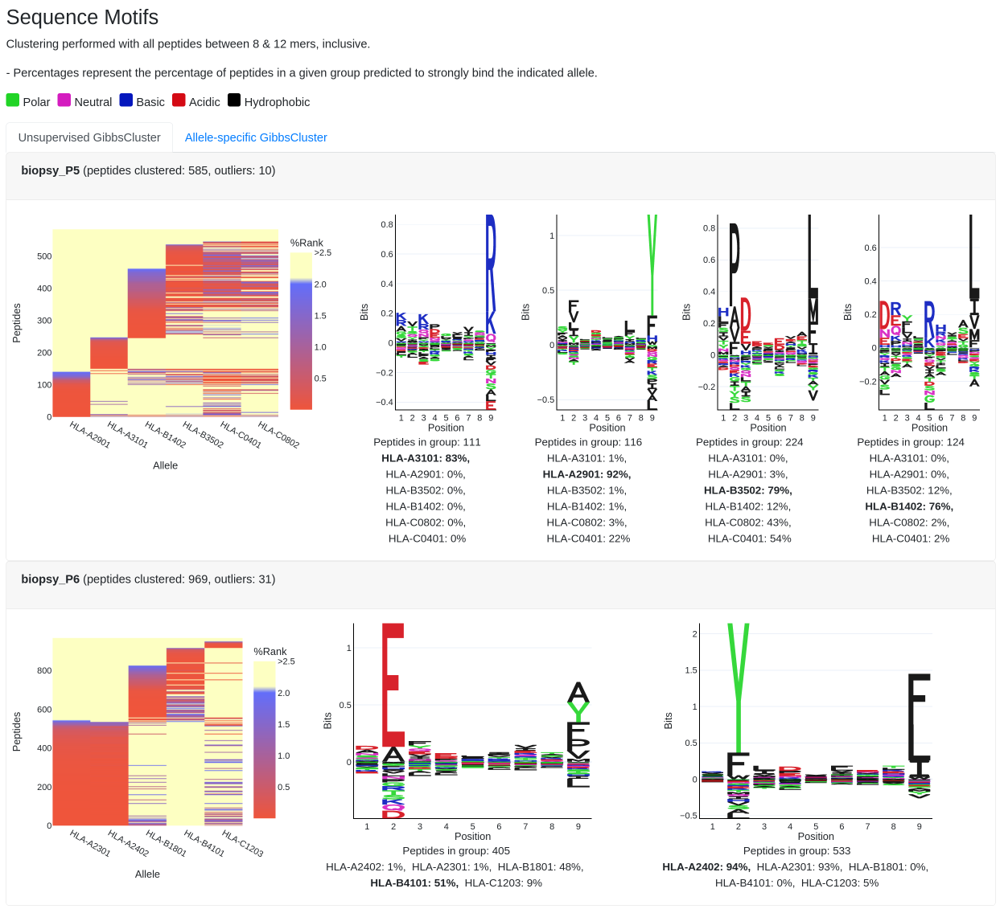

# MhcVizPipe (MVP)
A reporting pipeline for visualization and quality control of immunopeptidomics MS data.

MhcVizPipe is intended for rapid assessment and comparison of general sample quality and composition across a single or multiple
files. Example use cases of MhcVizPipe are assessment of QC samples or comparison of samples during method development.

MhcVizPipe connects the bioinformatic tools NetMHCpan, NetMHCIIpan and GibbsCluster and generates organized
and easy-to-understand reports in HTML format. The reports are fully portable and can be viewed on any computer
with a modern web browser.

MhcVizPipe comes with both a [graphical user interface](https://github.com/CaronLab/MhcVizPipe/wiki/Usage) 
and a [command line interface](https://github.com/CaronLab/MhcVizPipe/wiki/Command-line-interface). For help 
installing and using MhcVizPipe, please [visit the wiki](https://github.com/CaronLab/MhcVizPipe/wiki).

Here are some of the features of the reports generated using MhcVizPipe:

## Sample Overview

The "Sample Overview" sections gives you a quick look at the peptide length distributions, QC scores 
(LF and BF score), and the overlapping sets of peptides between multiple samples.


## Annotation Results

The "Annotation Results" section summarizes the results of NetMHCpan(4.0 or 4.1) or NetMHCIIpan4.0. A table shows the 
number and proportion of strong, weak and non-binders per sample per allele while overall binding characteristics of
each sample are displayed in a single figure.


## Clustering and Sequence Motifs

The "Sequence Motifs" section highlights the prominent motifs identified by GibbsCluster, including motifs generated from the analysis of
all peptides ("Unsupervised GibbsCluster") and motifs generated for each allele-specific peptide list as identified by
NetMHCpan or NetMHCIIpan ("Allele-specific GibbsCluster").



## When to use MhcVizPipe

MhcVizPipe is intended for situations where you want a quick and consolidated view of the general quality 
and composition of one or more immunopeptidomics samples:
- QC samples
    - Compare numbers of binders, distribution of binders per allele and prominent binding motifs with 
    previous QC sample to check consistency of data
- Quality check of sample batches
    - Rapidly check for overall sample quality
    - Check for possible labeling issues (e.g. switch-ups of class I and class II)
- Comparison of multiple samples in a method development experiment
    - Compare general composition across multiple conditions

## When not to use MhcVizPipe

MhcVizPipe is not intended for situations where you want data mining of your sample or if the sample is 
uncharacterized. For example:
- Finding new motifs in data
    - MhcVizPipe is designed to show you the most prominent motifs in your data, not find every single possible 
      motif or "hidden" motifs. If you are looking for something that might be hidden or requires manipulation of 
      the data to find, you will need to do this analysis yourself.
- Uncharacterized samples
    - MhcVizPipe expects you to know your sample(s). E.g. you should know if it is class I or class II and what 
    alleles are expressed.
- As a replacement for a biologist or bioinformatician
    - MhcVizPipe automates some routine and time-intensive tasks for you, but it does not provide biological insight
    beyond what you can see in the report! MhcVizPipe gives you a general characterization of the sample, not 
    a deep biological interpretation.

## System requirements

#### Operating system
MhcVizPipe will run natively on Linux (e.g. Ubuntu) or MacOS systems. It can also be installed on Windows 10 systems
using the Windows Subsystem.

#### Memory and CPU requirements
There are no hard memory or CPU requirements for MhcVizPipe. However, because MhcVizPipe utilizes multi-threading you
will see performance increases on systems with higher numbers of CPUs.

## Installation

Below you will find a brief overview of the installation steps and usage of the tool. For
more details please [visit the wiki](https://github.com/CaronLab/MhcVizPipe/wiki).

Note that MVP runs natively on Linux and Mac systems. If you have a Windows computer, you can follow
[these instructions](https://github.com/CaronLab/MhcVizPipe/wiki/Windows-installation) to install it using the
Windows Subsystem for Linux.

There are two ways to install MhcVizPipe:

1. From the [releases section](https://github.com/CaronLab/MhcVizPipe/releases), download a standalone package 
   which contains Python and all the required Python packages. The only additional steps 
   you need to perform are to download GibbsCluster, NetMHCpan and NetMHCIIpan and extract them into a directory called 
   "tools" inside the MhcVizPipe directory. This option is completely portable, e.g. you could move the program onto 
   a USB stick and use it on any compatible system (note that using a USB doesn't currently work in Windows).
   - Because of system dependencies of the standalone Python distribution we are using, we cannot guarantee 
    the portable package will work on every computer. However, we have tested in Ubuntu 16.04-20.04, LinuxMint 18, 
      several versions of Mac OSX (High Sierra and greater) and using the Windows Subsystem for Linux, and generally 
      have had no issues. If you encounter problems, please try option 2 below.
2. Install MhcVizPipe into an existing Python environment using `pip install MhcVizPipe` and configure 
   the settings to point to existing installations of GibbsCluster, NetMHCpan and netMHCIIpan.
   - This requires an existing Python installation on your system.
   
For complete installation instructions, [visit the wiki](https://github.com/CaronLab/MhcVizPipe/wiki).

## Usage
Double-click the `MhcVizPipe` executable file in the MhcVizPipe folder.

You should see the following message (or something similar depending on the version and operating system):
```
    ========================================
    MhcVizPipe v0.7.8
    
    Welcome to MhcVizPipe! To open the GUI, open the following link
    in your web browser: http://0.0.0.0:8080
    (To do this, most likely right click the link and choose something
    like "Open URL" or "Open in browser". If that doesn't work,
    copy and paste it into your browser.)
    
    For a brief introduction to using the GUI, click the link to
    "help and resources" near the top of the GUI. For more information
    and the latest updates please visit our GitHub repository:
    https://github.com/CaronLab/MhcVizPipe.

    To shut down this instance of MhcVizPipe, close this window or
    use the following keyboard shortcut in the terminal:
      ctrl+c
    
    ========================================
```
You will notice this link in the message: `http://0.0.0.0:8080`. Right click and select "Open in browser" and
the MhcVizPipe will open up in your web browser (or copy-paste it into your browser if you aren't able to right-click
to open).

For detailed usage, see the [wiki usage page.](https://github.com/CaronLab/MhcVizPipe/wiki/Usage)

If you need further help please [open an issue!](https://github.com/CaronLab/MhcVizPipe/issues)