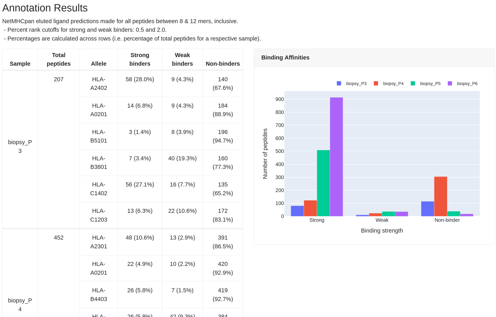

# MhcVizPipe (MVP)
A reporting pipeline for visualization of immunopeptidomics MS data.

MhcVizPipe connects the bioinformatic tools NetMHCpan, NetMHCIIpan and GibbsCluster and generates organized
and easy-to-understand reports in HTML format. The reports are fully portable and can be viewed on any computer
with a modern web browser. Here are some of the features of MhcVizPipe:

### Sample Overview


The "Sample Overview" sections gives you a quick look at the peptide length distributions and the overlapping sets of
peptides between multiple samples.

### Annotation Results


The "Annotation Results" section summarizes the results of NetMHCpan(4.0 or 4.1) or NetMHCIIpan4.0. A table shows the 
number and proportion of strong, weak and non-binders per sample per allele while overall binding characteristics of
each sample are displayed in a single figure.

### Peptide Grouping and Sequence Motifs


The "Sequence Motifs" section highlights the GibbsCluster results, including motifs generated from the analysis of
all peptides ("Unsupervised GibbsCluster") and motifs generated for each allele-specific peptide list as identified by
NetMHCpan or NetMHCIIpan ("Allele-specific GibbsCluster").

## System requirements

#### Operating system
MhcVizPipe will run natively on Linux (e.g. Ubuntu) or MacOS systems. It can also be installed on Windows 10 systems
using the Windows Subsystem.

#### Memory and processors
There are no hard memory or CPU requirements for MhcVizPipe. However, because MhcVizPipe utilizes multi-threading you
will see performance increases on systems with higher numbers of CPUs.

## Installation and usage

Below you will find a brief overview of the installation steps and usage of the tool. For
more details please [visit the wiki](https://github.com/CaronLab/MhcVizPipe/wiki).

Note that MVP runs natively on Linux and Mac systems. If you have a Windows computer, you can follow
[these instructions](https://github.com/CaronLab/MhcVizPipe/wiki/Windows-installation) to install it using the
Windows Subsystem for Linux.

#### Quick installation
Below is a quick overview of the installation steps. For more details, [visit the wiki](https://github.com/CaronLab/MhcVizPipe/wiki).
1. Right-click and choose "save link as" to download 
[this file](https://github.com/CaronLab/MhcVizPipe/raw/master/MhcVizPipe_install.sh) and place
it in the same directory as the 
[NetMHCpan, NetMHCIIpan and GibbsCluster downloads](https://github.com/CaronLab/MhcVizPipe/wiki/Downloading-third-party-software)
(do not extract the downloads).
2. Open a terminal and navigate to this directory
    - Example: Invoke the following command (i.e. type it and hit enter): `cd \Users\isoiris\Downloads\MVP_Tools`,
    where you would replace `\Users\isoiris\Downloads\MVP_Tools` with the path to the directory on your computer.
3. Invoke this command (i.e. type it in and hit enter): `chmod +x ./MhcVizPipe_install.sh`
4. Invoke this command: `./MhcVizPipe_install.sh`
5. During installation, choose to add MhcVizPipe to you PATH

#### Usage
From any terminal, enter the following command:
```
MhcVizPipe
```
You should see the following message:

     ========================================
     MhcVizPipe v0.3.1

     Welcome to MhcVizPipe! To open the GUI, open the following link
     in your web browser: http://0.0.0.0:8080
     (To do this, most likely right click the link and choose something
     like "Open URL" or "Open in browser". If that doesn't work,
     copy and paste it into your browser.)

     If this is you very first time running MVP, when you open the 
     link a window should appear which will help you install GibbsCluster,
     NetMHCpan and NetMHCIIpan if you have not already.

     For a brief introduction to using the GUI, click the link to
     "help and resources" near the top of the GUI. For more information
     and the latest updates please visit our GitHub repository:
     https://github.com/kevinkovalchik/MhcVizPipe.

     ========================================
You will notice this link in the message: `http://0.0.0.0:8080`. Right click and select "Open in browser" and
the MhcVizPipe will open up in your web browser.

For detailed usage, see the [wiki usage page.](https://github.com/CaronLab/MhcVizPipe/wiki/Usage)

If you need further help please [open an issue!](https://github.com/CaronLab/MhcVizPipe/issues)